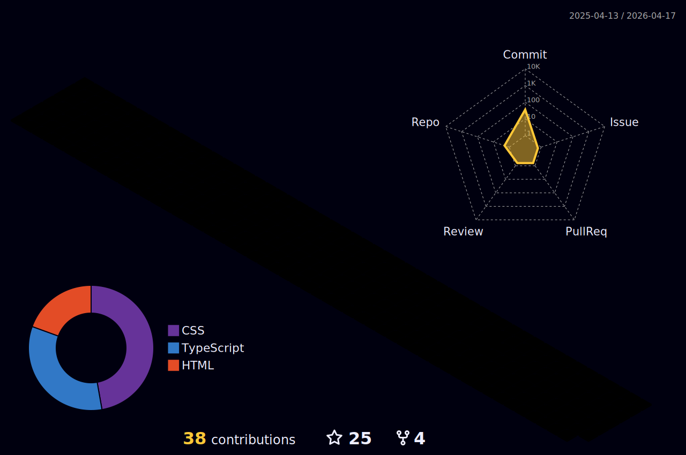

# Alexandre Pereira || MalkavianSon

> ###### _There might be new technology, but technological progress itself was nothing new - and over the years it had not destroyed jobs, but created them._ - __Margaret Thatcher__

 

##

- ##### Pandora👶❤️️ || Technology⚙️🌐 || Pets🐈🐾 || Antropology📚🌎 || Philosophy🧠🧩️
- ##### ENTJ-A
- #####  7w6
- ##### Best game of the world: Vampire, the Masquerade 3ª edition (Call me to your campaign)

## Definitely worth check it 👇

> - [Adoledates](https://github.com/Malkavianson/Blue_Modulos/blob/6b3ff4628865668d129a1c1ae7a2ddef761900a4/Modulo_1/Projetos/Modulo_1_Projeto_3.js) -> _Interactive fiction game - game in Light Novel format made only with vanilla javascript. It's not the greatest game of all time, but the story was pretty cute_.
>>  

> - [GameDevs_Page](https://github.com/Malkavianson/games) -> _Collaborative REACT-TS project consuming [GamingDevs API](https://github.com/Malkavianson/gamingdevsApi). A range of features included, we tried to make an light alternative to the IMDB site._
>>      

> - [GamingDevs API](https://github.com/Malkavianson/gamingdevsApi) -> _Api using NESTJS and Prisma using TypeScript to persist info about the best games_
>>        

> - [Vampire, The Masquerade random sheet generator API](https://github.com/Malkavianson/npcgene) -> _Api to create stat sheets to_ __Vampire, The Masquerade RPG__. _This service was created thinking in all narrators around the world that need to make theis own sheet for_ __NPC__ _in_ __campaigns__. __This API generate a unique sheet that can be used with your friends.__
>>       

> - [Vampire, the Masquerade Generator](https://github.com/Malkavianson/vampiregenerator) -> _Web Page in React-ts persisting with the above_ [API](http://vtmgenerator.herokuapp.com/) _using styled-components, canva and react-router_
>>     

> - [MonkeyTech API v2](https://github.com/Malkavianson/API_MonkeyTech_v2) -> _Api in express persisting in mongodb database using_ __Mongose__ _simulating an e-commerce service_
>>  

> - [Thoths Tabern](https://github.com/Malkavianson/ThothsTabern) -> _Finder word game using sequelize and express. Cool to play with friends_
>>   

> - [Blue_Pokedex](https://github.com/Malkavianson/Blue_pokedex) -> _A simple EJS project with mocked in array db simulating an pokedex. I've made a cool slider to show the cards_ 😁
>>     

### I already worked with all this 👇🏻😊:
~~tomorrow this list can be updated, come here to check~~

###

 <a href="https://github.com/Malkavianson">
 

###

  
  
  

###

  
  
  <!--  -->
  <!--  -->
  

###

  
  
  

###

  
  
  

###

  
  
  

###

  
    
  

###

  
  
    

###

    
  <!--    -->
    
    

###

    
    
    

###

    
  
  

###

    
  
  

###

  
    

##

### My contributions to community progress:

