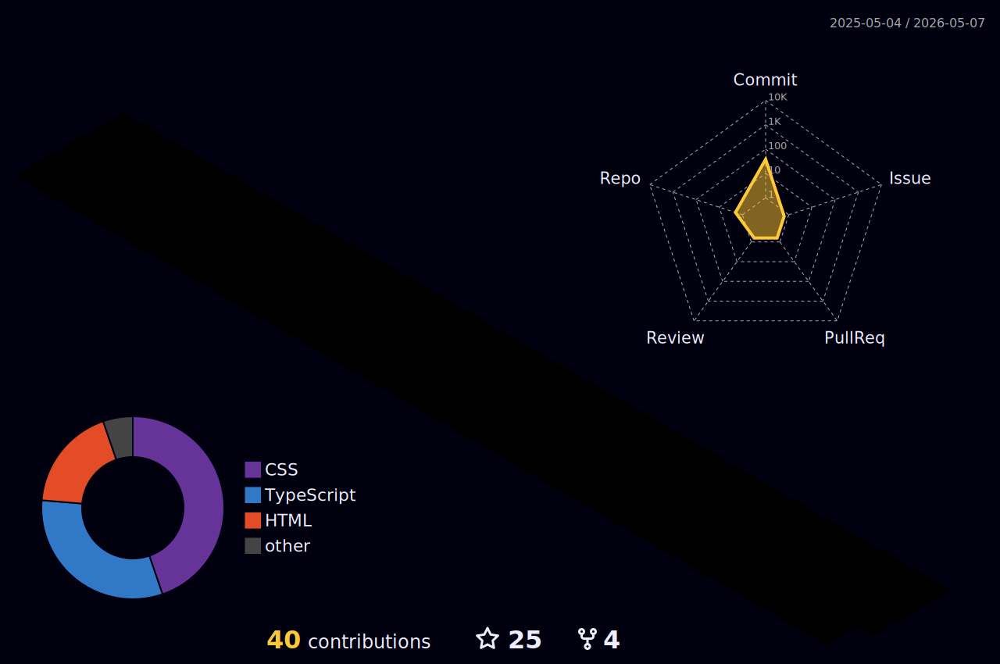

# Alexandre Pereira | Malkavianson

> ###### \_There might be new technology, but technological progress itself was nothing new - and over the years it had not destroyed jobs, but created them.\_ - \_\_Margaret Thatcher\_\_

### Quem sou:

- ##### Pandora👶️️ || Technology⚙️🌐 || Pets🐈🐾 || Antropology📚🌎 || Philosophy🧠🧩️

Não sou um dev que só “faz funcionar”.

Eu questiono, simplifico e estruturo.

Tenho facilidade em:
- enxergar falhas antes que elas virem problema
- transformar ideias confusas em sistemas funcionais
- reduzir complexidade sem sacrificar resultado

Se algo está mal organizado, inconsistente ou frágil — eu não ignoro.
Eu quebro, entendo e reconstruo melhor.

---

### Como eu penso

- Segurança não é opcional
- Código bonito sem propósito é vaidade
- Simplicidade bem feita é mais difícil que complexidade

Tenho um perfil analítico, direto e pouco tolerante a soluções improvisadas quando o problema exige estrutura.

---

### Soft skills (as que realmente importam)

- Pensamento crítico acima da média
- Facilidade em aprender de forma autônoma
- Comunicação objetiva (sem rodeios desnecessários)
- Capacidade de trabalhar sob pressão sem perder clareza
- Visão sistêmica (não olho só função, olho impacto)

---

###  Stack principal

---

### Projetos selecionados

#### 🧛 Vampire RPG Generator
Sistema completo (API + Web) para geração automatizada de fichas
Foco em utilidade real para narradores

#### 🎮 GamingDevs Ecosystem
Frontend + API estruturados
Tentativa prática de construir algo escalável com propósito

#### 🛒 MonkeyTech API
Simulação de e-commerce
Base para entender comportamento de sistemas reais

---
### Direção

Hoje me interesso mais por:
- arquitetura de sistemas
- consistência de dados
- segurança e validação
- aplicações que resolvem problemas reais

Menos "hype", mais solidez.

---

### *Esse tem um lugar especial*
_Gostaria de pontuar esse repositório, não pela sua eficácia ou modernidade, mas por que este é o meu primeiro projeto. Logo no primeiro mês de curso, fomos desafiados a criar um jogo apenas com JS e lógica de programação. Enquanto outros fizeram um jogo da velha, ou uma forca, eu quis ir além. Na época eu não sabia fazer imports, ou criar classes. Mal sabia fazer objetos._

_Hoje, com anos de programação percebo o fato de eu ter inventado, espontaneamente, um conceito chamado em engenharia de software de simulação orientada a estado. É tipo um simulador: tenta criar mundo, regras, personagens, ciclos de tempo... Eu vejo que com pouco tempo de programação, já pensava em sistemas. Mas não sabia disso. Só percebi o quão complexo foi o meu projeto quando vi a entrega dos outros alunos._

_Não acho que fui melhor que ninguém por isso, apenas que eu estava em um caminho diferente._

_Tem erros? Óbvio! Mas:_

_O código vira quase uma tradução imperfeita do raciocínio._

_E isso explica por que o arquivo virou um monólito gigante. (Eu não sabia da existência dos imports)_

_Pensei em sistema vivo primeiro, na simulação inteira — não em módulos._

_Tentei manter o universo todo consistente. Quis controle total do estado... Por isso usei globais sem medo. Não foi descuido técnico. Foi tentativa de manter coerência narrativa._

_Tecnicamente errado. Cognitivamente lógico._

_Tentei fazer um RPG narrativo com engine própria em Node puro no terminal._
* _Eu não sabia POO._
* _Eu não sabia modularização._
* _Não sabia arquitetura._

_Mesmo assim tentei construir uma simulação de vida._

_*Porquê do lugar especial para mim:*_

_Esse foi um projeto ambicioso demais para o meu conhecimento da época... E exatamente por isso ele funcionou como catalisador._

_Se eu reescrevesse hoje esse jogo, não faria melhor… Faria outro tipo de jogo. Porque hoje eu pensaria primeiro em arquitetura, e naquela época eu pensava primeiro em experiência humana._

_Mas tem algo que eu tiro de filosofia desse projeto para a minha vida._

> Não sigo o caminho mais rápido nem o mais comercial. Construo sistemas complexos o suficiente para serem simples, porque só o que é bem compreendido consegue durar.

- [Adoledates](https://github.com/Malkavianson/Blue\_Modulos/blob/6b3ff4628865668d129a1c1ae7a2ddef761900a4/Modulo\_1/Projetos/Modulo\_1\_Projeto\_3.js) -> _Interactive fiction game - game in Light Novel format made only with vanilla javascript. It's not the greatest game of all time, but the story was pretty cute.

---

### 📉 Contribuições Públicas (Pode estar desatualizado)

