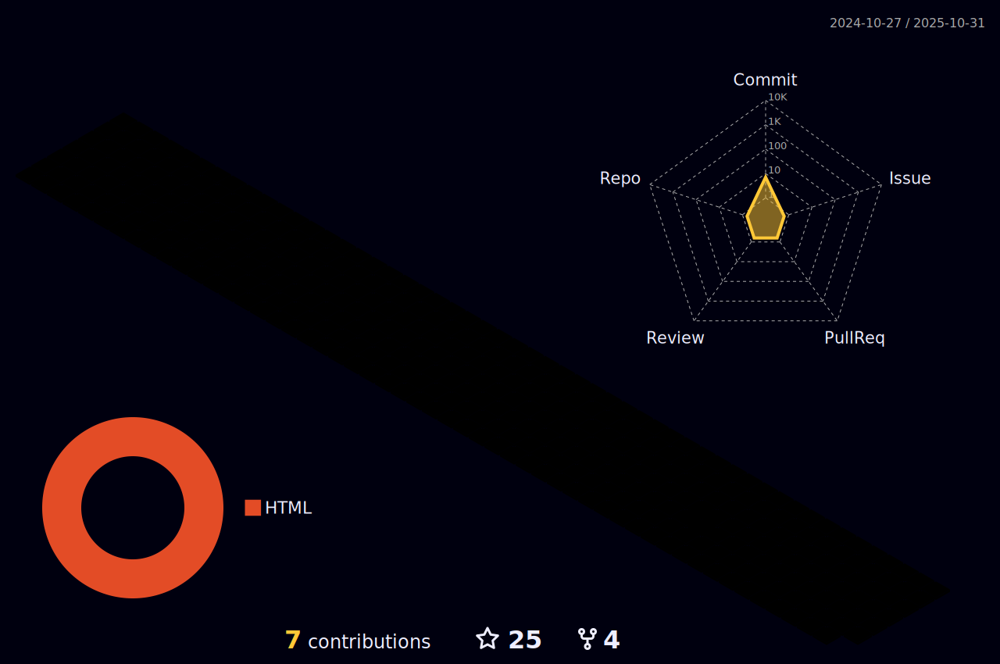

### Alexandre Pereira || MalkavianSon 🧛🌈🦄

 <a href="https://github.com/Malkavianson">
 
 

### Principais tecnologias utilizadas

  
  
  

 
###

  
  

###

  
  
  
  
  

###
 

    
  
    
    

##
 
#  [Πανδώρα](https://scontent.fbhz1-2.fna.fbcdn.net/v/t39.30808-6/277999683_2545950552202995_8411866977418401668_n.jpg?_nc_cat=104&ccb=1-5&_nc_sid=730e14&_nc_eui2=AeHMD0XOvs7KAqwuLTFwQX3mb4Ch4YoDniVvgKHhigOeJaB9PAfWxuBBoSrbXUzILWuh-DFNkS0zdVtS-LLGUmiN&_nc_ohc=gbzDHK0qpgYAX_K6kfl&_nc_zt=23&_nc_ht=scontent.fbhz1-2.fna&oh=00_AT8YG5sb2GWcByXHbStAG7E9O5PgEp8lVhRjb9YfPEnNGA&oe=62514D24) 

- ### [eNygma.io 🎮](https://malkavianson.github.io/nygma/)
- ### ENTJ-A
- ### Defensor do progresso e da ciência
- ### Apaixonado por games, antropologia ,algorítmos, filosofia e bichinhos 🐈 🐕 🐴
- ### Mestre de RPG e Narrador de Vampiro - A Máscara
 
##

